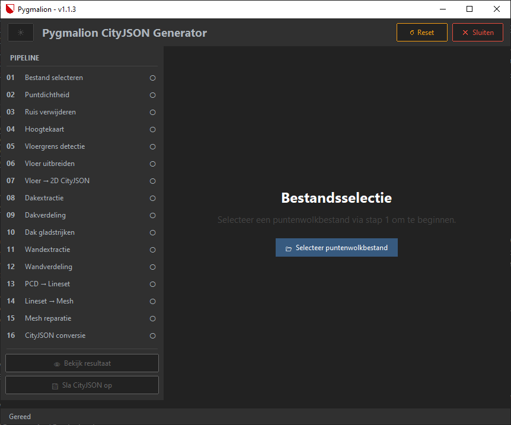

# Pygmalion Pointcloud Converter

---

<p align="center">
  <a href="https://www.python.org/downloads/"></a>
  
  <a href="https://www.microsoft.com/windows"></a>
  <a href="https://github.com/Maerecque/Pygmalion/actions/workflows/ci.yml"></a>
  <a href="https://flake8.pycqa.org/"></a>
  <a href="https://mypy.readthedocs.io/"></a>
  <a href="https://creativecommons.org/licenses/by-nc-sa/4.0/"></a>
</p>

<p align="center">
  
  
  
  
</p>

<p align="center">
  
</p>

Pygmalion is een gespecialiseerde applicatie voor het verwerken van puntenwolken (point clouds), ontwikkeld in opdracht van de Vereniging van Nederlandse Gemeenten (VNG). Het primaire doel van de software is het inlezen, opschonen, optimaliseren en structureren van puntenwolkdata. De focus ligt hierbij specifiek op historische werfkelders, zodat deze visuele informatie voor de lange termijn bewaard kan worden in open, gestandaardiseerde 3D- en 2D-formaten.

Hoewel de verwerkingspipeline uitvoerig is getest en geoptimaliseerd met ruimtelijke scans van de Utrechtse werfkelders, is het systeem zo ontworpen dat het moeiteloos uiteenlopende puntenwolkdatasets kan verwerken. De gestandaardiseerde output is bedoeld om naadloos aan te sluiten op stedelijke planning, vastgoedbeheer, bouwtechnische inspecties en het reguliere onderhoud van gemeentelijke infrastructuur.

---

## Belangrijkste functionaliteiten

- **Ondersteuning voor meerdere formaten:** Importeer probleemloos industriestandaard LAS-, LAZ- en E57-puntenwolken.
- **Robuuste verwerkingspipeline:**
  - Geautomatiseerde downsampling en het filteren van structurele ruis.
  - Vlakextractie (plane extraction) en slimme algoritmen voor automatische data-reparatie.
  - Transformaties van coördinatensystemen.
- **Dubbele exportmotor:** Sla bestanden op in breed compatibele, gestandaardiseerde formaten die ideaal zijn voor langdurige gemeentelijke archivering:
  - 2D-formaten voor traditionele cartografie en CAD-integratie.
  - 3D-formaten voor geavanceerde visualisatie en ruimtelijke analyses.
- **Interactieve voorvertoningen:** Maak optioneel gebruik van realtime visualisatietools om tussenstappen en definitieve resultaten direct te inspecteren.

---

## Systeemvereisten

### Hardwarespecificaties
De applicatie is expliciet gecompileerd voor en getest op uitsluitend Windows 10 en Windows 11.

| Specificatie | Minimale vereisten | Aanbevolen specificaties |
| :--- | :--- | :--- |
| **CPU** | Intel Core i7 (8e gen) of AMD-equivalent | Intel Core i7 (10e gen) of AMD-equivalent |
| **RAM** | 8 GB | 16 GB of meer |
| **GPU** | Geïntegreerde videokaart | Dedicated GPU (minimaal 6 GB VRAM) |

### Omgevingsvereisten
- Python Runtime: Python 3.x
  - Oudste geverifieerde versie: 3.7.9
  - Nieuwste geverifieerde versie: 3.12.10
- Afhankelijkheden: Alle vereiste externe bibliotheken staan beschreven in `requirements.txt`.

---

## Aan de slag

### 1. Installatie
Clone de repository of download de broncode, en installeer vervolgens de benodigde afhankelijkheden via de terminal. Voer de volgende opdrachten uit in de opdrachtprompt:

```cmd
git clone [https://github.com/Maerecque/Pygmalion.git](https://github.com/Maerecque/Pygmalion.git)
cd Pygmalion
py -m pip install -r requirements.txt
```

### 2. Uitvoeringsmodi

#### Optie A: Command Line Interface (CLI)
Om de verwerkingssoftware direct vanuit de Python-omgeving te draaien:

```cmd
py -m main
```

1. Selecteer het gewenste LAS-, LAZ- of E57-bestand wanneer het systeem hierom vraagt.
2. De pipeline loodst de dataset automatisch door de opeenvolgende verwerkingsstappen.
3. Kies of je de externe ruimtelijke viewer wilt starten om de tussentijdse stappen te controleren.

#### Optie B: Zelfstandig uitvoerbaar bestand (Standalone Executable)
Je kunt de applicatie ook compileren tot een zelfstandig Windows-bestand (.exe):
1. Dubbelklik op `prep.cmd` of voer dit uit vanuit de terminal.
   - *Let op:* Dit proces start de achtergrondsystemen voor het compileren op en kan enkele minuten duren. Geef administratorrechten als Windows Gebruikersaccountbeheer (UAC) hierom vraagt.
2. Zodra dit is afgerond, wordt er een zelfstandig uitvoerbaar bestand genaamd `Pygmalion.exe` gegenereerd.
   - *Let op:* Presets (voorinstellingen) worden tijdens het compileren vastgelegd in het bestand. Als je de configuratie of presets aanpast, moet je `prep.cmd` opnieuw uitvoeren om een up-to-date uitvoerbaar bestand te genereren.
3. Start `Pygmalion.exe` direct op om de grafische gebruikersinterface (GUI) te openen.

---

## Bijdragen

Bijdragen aan Pygmalion zijn van harte welkom! Om de stabiliteit en de kwaliteitsstandaard van de code te waarborgen, vragen we je het volgende stappenplan te volgen:
1. Fork deze repository en maak een eigen feature-branch aan.
2. Zorg ervoor dat je wijzigingen voldoen aan de stijlrichtlijnen van de codebase (gecontroleerd via `flake8` en `mypy`).
3. Schrijf toepasselijke testcases voor eventuele nieuwe functionaliteiten.
4. Dien een Pull Request in.

*Let op:* De `master`-branch is beveiligd. Alle binnenkomende wijzigingen vereisen een codereview en moeten de CI-pipelines succesvol doorlopen voordat ze worden samengevoegd.

---

## Achtergrond & Context

Dit systeem is ontstaan als afstudeerproject voor de HBO-ICT-opleiding Artificial Intelligence aan de Hogeschool Utrecht (zomer 2023). Na een korte inactieve periode is de ontwikkeling medio 2024 officieel hervat om te voldoen aan de productie-eisen en langetermijnstrategieën voor digitale archivering van de Vereniging van Nederlandse Gemeenten (VNG).

Hoewel het aanvankelijk nooit de bedoeling was om hier een besloten softwaretool van te maken, maakte de samenwerking met de VNG de bredere, structurele voordelen duidelijk die dit hulpmiddel kan bieden aan andere gemeenten, engineeringteams en archiefinstellingen wereldwijd. Om die reden is het project omgevormd tot een open-source initiatief.

### Oorsprong van de naam
Het project ontleent zijn naam aan de klassieke Griekse mythe van Pygmalion, een beeldhouwer die een standbeeld maakte dat zodanig mooi en levensecht was dat de godin Aphrodite het uiteindelijk tot leven wekte. Dit dient als metafoor voor het achterliggende doel van deze applicatie: het nemen van ruwe, gefragmenteerde en levenloze puntenwolkdata en deze transformeren tot een hoogwaardig, gestructureerd en dynamisch 3D-object.

---

## Licentie

Dit repository en de bijbehorende bronbestanden worden gedistribueerd onder de Creative Commons Naamsvermelding-NietCommercieel-GelijkDelen 4.0 Internationaal (CC BY-NC-SA 4.0) licentie.

Het is toegestaan om dit materiaal aan te passen, te remixen en te verspreiden, mits:
1. **Naamsvermelding:** Je vermeldt de originele auteur op de juiste wijze en linkt naar de licentie.
2. **NietCommercieel:** Het materiaal en de afgeleiden daarvan mogen niet worden gebruikt voor commerciële doeleinden.
3. **GelijkDelen:** Eventuele aangepaste versies van deze software moeten onder exact dezelfde licentieovereenkomst worden uitgebracht.